# Drylus - Drawbotics Styles Library

__NOTE__: this is a monorepo, meaning all the code is divided into packages (`/packages`). All packages are dependencies of each other meaning the code can be shared between them. To manage the packages we use [Lerna](https://github.com/lerna/lerna).
```
npm install
```

There are 7 total packages:
- [drylus-style-vars](/packages/drylus-style-vars): This package holds all the variables used in the Drawbotics styles. Exports js, less and css vars.
- [icons](/packages/icons): This package holds all the icons used throughout the Drawbotics design system
- [react-drylus](/packages/react-drylus): This is basically the source of all the components for the library; it uses React
- [vanilla-drylus](/packages/vanilla-drylus): The vanilla JS version of the library. The styles (CSS) is extracted from `react-drylus` using `extract-emotion` (see next point) and bundled to be used in non-react apps. Since we can't extract JS logic from React, the component logic is re-written in non-react code and bundled separately as well
- [extract-emotion](/packages/extract-emotion): A small CLI tool to extract the CSS from React components that use [emotion](https://github.com/emotion-js/emotion) for styling (see [readme](/packages/extract-emotion/README.md))
- [drylus-web-components](/packages/drylus-web-components): __WIP__ Auto generated from `react-drylus`
- [styleguide](/packages/styleguide): This is where we write all the documentation and code examples for the library; examples are written in React and the equivalent HTML and web-components version are auto generated

### How do these work together?
<p align="center">
  
</p>

The basic flow is the following:
- `icons` is an independent package that only deals with icons and generating the icon fonts
- `drylus-style-vars` is independent and generates the variables for colors, font sizes, margins etc
- `react-drylus` feeds from the two above and is the core of the design system. It's from here that nearly all of the styles and components are created
- `extract-emotion` feeds from `react-drylus` to get the components and extracts the CSS
- `vanilla-drylus` gets the CSS from `extract-emotion`, it then also outputs its own JS bundle for vanilla JS interactions with components
- `styleguide` simply uses the packages that output bundles/components to showcase them

## Development
All commands should be run from the root of the project. If you want to have everything compiling and hot-reload while developing, then run all the `npm run watch:[package]` commands in separate terminal processes.

__NOTE__ While each package's readme describes the commands to run the code (dev or production) it is better to use the root commands to avoid having to navigate between folders.

__style-vars__
```
npm run build:vars
```

__icons__
```
npm run build:icons
npm run dev:icons
```

__react-drylus__
```
npm run watch:react
npm run test:react
npm run build:react
```

__vanilla-drylus__
```
npm run watch:vanilla
npm run build:vanilla
```

__extract-emotion__
```
npm run test:extract-emotion
npm run build:extract-emotion
```

__styleguide__
```
npm run watch:styleguide
npm run build:styleguide
```

To add a new npm library/package to a package's dependencies:
```
npx lerna add [npm-package-name] --scope=@drawbotics/[package]
```

To add a new library as a dev dependency:
```
npx lerna add [npm-package-name] --scope=@drawbotics/[package] --dev
npx lerna link convert
(and sometimes)
npm install
```

### Requirements
Some package require extra configuration to be used (this is also mentioned in each package's readme).

- `icons` requires you to set some environment variables at the root of the monorepo to sync the code with the Drawbotics CDN


## Publishing
We use Lerna's `publish` command to automate the correct versioning and tagging of packages. All packages in this repo are published, with the exception of `styleguide` since it is only used to build the web app for the styleguide.

Once you've finished with the changes and are ready to publish:
```
npm run publish
```
Which will essentially run
```
npx lerna pulbish --force-publish
```

And follow the CLI prompts to release a new version for all the packages, even the unchanged ones.
